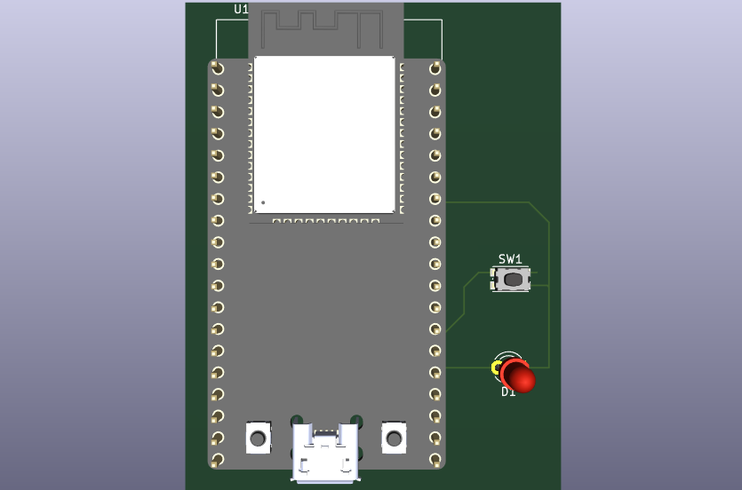
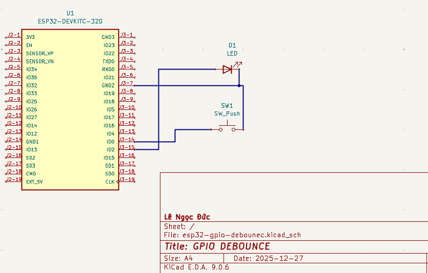

# 📦 GPIO Debounce (ESP32)

<p align="center">
  
</p>

<p align="center">
  <b>A clean and efficient GPIO debounce implementation for ESP32-DEVKITC-32D.</b><br>
  Designed for reliability, low CPU overhead, and easy extensibility.
</p>

---

## 🎬 Demo

<p align="center">
  
</p>

This demo demonstrates stable button state detection under real mechanical noise conditions, without blocking the CPU or abusing delays.

---

## 📐 Hardware Design

<p align="center">
  <b>3D Model</b><br>
  
</p>

<p align="center">
  <b>Schematic</b><br>
  
</p>

The hardware setup represents a typical push-button input with pull-up configuration, suitable for validating debounce logic on real ESP32 hardware.

---

## ✨ Features

- Finite State Machine (FSM)-based debounce design with clean, readable structure  
- Fully non-blocking implementation (no `delay()`, no busy-wait loops)  
- Low CPU overhead, safe for real-time and multitasking systems  
- Easy to scale for multiple GPIOs or different debounce timing requirements  

---

## 🛠 Tech Stack

- **MCU:** ESP32 (ESP32-DEVKITC-32D)  
- **Language:** C  
- **Framework:** ESP-IDF  
- **Toolchain:** GCC, CMake  

---

## 🚀 Getting Started

```bash
git clone https://github.com/your-username/gpio-debounce-esp32.git
cd gpio-debounce-esp32
idf.py build
idf.py flash
idf.py monitor
